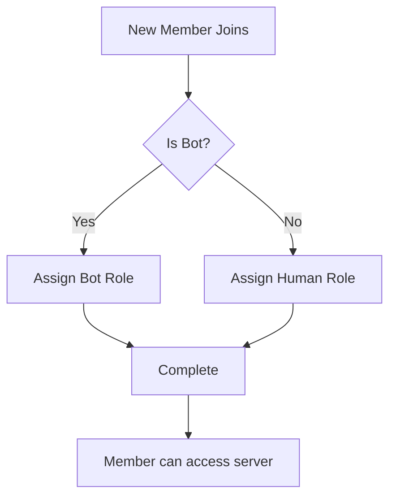

# AutoRole Commands

AutoRole system automatically assigns roles to new members when they join your server. This eliminates the need for manual role assignment and ensures consistent role distribution.

## Quick Reference

| Command | Description | Permission Required |
|---------|-------------|-------------------|
| [`&autorole add human`](#autorole-add-human) | Add auto role for human members | Manage Roles |
| [`&autorole add bot`](#autorole-add-bot) | Add auto role for bot members | Manage Roles |
| [`&autorole list`](#autorole-list) | List all configured auto roles | Manage Roles |
| [`&autorole reset`](#autorole-reset) | Reset all auto role configurations | Manage Roles |

## Overview

The AutoRole system provides:

- **Separate role assignment** for humans and bots
- **Instant role assignment** when members join
- **Fallback protection** if role assignment fails
- **Easy configuration** with simple commands

!!! tip "Best Practices"
    - Use AutoRole for general member roles like `@Members` or `@Verified`
    - Don't assign administrative roles automatically
    - Test AutoRole with a friend joining/leaving
    - Keep role hierarchy in mind when setting up

## Commands

### `&autorole add human`

Add an automatic role for human members.

<div class="command-syntax">
&autorole add human &lt;role&gt;
</div>

**Parameters:**
- `role` - The role to assign to human members

**Examples:**
```bash
&autorole add human @Members
&autorole add human @Humans
&autorole add human 123456789012345678  # Using role ID
```

**Bot Permissions Required:**
- Manage Roles

**User Permissions Required:**
- Manage Roles

??? example "Usage Example"
    **Setting up member role:**
    ```bash
    &autorole add human @Members
    ```
    
    **Bot Response:**
    ```
    ✅ AutoRole Updated
    Human members will now receive @Members role when joining.
    ```

**Troubleshooting:**

=== "Role Higher Than Bot"
    **Error:** "Role is higher than mine"
    
    **Solution:** Move bot's role above the target role in Server Settings > Roles

=== "Role Not Found"
    **Error:** "Role not accessible"
    
    **Solutions:**
    - Check if role exists and wasn't deleted
    - Ensure role isn't managed by another bot
    - Verify role isn't @everyone

=== "Missing Permissions"
    **Error:** "Missing permissions"
    
    **Solution:** Grant bot "Manage Roles" permission

### `&autorole add bot`

Add an automatic role for bot members.

<div class="command-syntax">
&autorole add bot &lt;role&gt;
</div>

**Parameters:**
- `role` - The role to assign to bot members

**Examples:**
```bash
&autorole add bot @Bots
&autorole add bot @Automated
```

**Features:**
- Only applies to Discord bots, not regular users
- Useful for organizing bots in member list
- Helps with permission management for bots

??? example "Complete Bot Setup"
    **Step 1: Create bot role**
    ```bash
    &create_roles Bots
    ```
    
    **Step 2: Configure AutoRole**
    ```bash
    &autorole add bot @Bots
    ```
    
    **Step 3: Verify setup**
    ```bash
    &autorole list
    ```

### `&autorole list`

List all configured auto roles.

<div class="command-syntax">
&autorole list
</div>

**No parameters required**

**Example Output:**
```
📋 AutoRole Configuration

Human Members: @Members
Bot Members: @Bots
All Members: not-set

✅ AutoRole is currently enabled
Last updated: 2 hours ago
Total roles assigned: 1,234
```

**Information Shown:**
- Current role assignments for humans and bots
- Whether AutoRole is enabled/disabled
- Statistics on role assignments
- Last configuration change

### `&autorole reset`

Reset all auto role configurations.

<div class="command-syntax">
&autorole reset
</div>

**No parameters required**

!!! warning "Destructive Action"
    This command removes ALL AutoRole settings and cannot be undone. Use with caution!

**Confirmation Required:**
The bot will ask for confirmation before proceeding.

**Example:**
```bash
&autorole reset
```

**Bot Response:**
```
⚠️ Confirmation Required
This will remove ALL AutoRole settings. Type 'confirm' to proceed or 'cancel' to abort.
```

## Advanced Configuration

### Multiple Roles

Currently, AutoRole supports one role per category (human/bot). To assign multiple roles:

1. Set up AutoRole for primary role
2. Use [Role Management commands](roles.md) for additional roles
3. Consider using role reactions for optional roles

### Role Hierarchy Considerations

!!! info "Role Hierarchy Rules"
    - Bot's role must be higher than AutoRole targets
    - AutoRole cannot assign roles higher than bot's position
    - @everyone role cannot be used with AutoRole
    - Managed roles (from other bots) cannot be assigned

### Integration with Other Features

AutoRole works seamlessly with:

- **[Role Management](roles.md)** - Additional role operations
- **[Moderation](moderation.md)** - Channel permissions based on roles
- **[Utility Commands](utility.md)** - Role-based information display

## Troubleshooting

### Common Issues

=== "AutoRole Not Working"
    **Symptoms:** New members don't receive roles
    
    **Checklist:**
    - [ ] AutoRole is configured (`&autorole list`)
    - [ ] Bot has "Manage Roles" permission
    - [ ] Bot role is above target role
    - [ ] Role exists and isn't deleted
    - [ ] Role isn't managed by another bot

=== "Some Members Not Getting Roles"
    **Possible Causes:**
    - Members joined before AutoRole was set up
    - Bot was offline when members joined
    - Role hierarchy issues
    - API rate limiting during mass joins
    
    **Solutions:**
    - Use `&role_all_human @role` to assign to existing members
    - Check bot uptime and status
    - Verify role permissions

=== "Bots Getting Human Roles"
    **Problem:** Bot members receiving human-designated roles
    
    **Solution:** 
    - Remove any "All Members" AutoRole setting
    - Use separate human and bot role configurations
    - Check if role is being assigned elsewhere

### Error Messages

| Error | Meaning | Solution |
|-------|---------|----------|
| "Role is higher than mine" | Target role is above bot's role | Move bot role higher in hierarchy |
| "Role not accessible" | Role doesn't exist or is managed | Check role exists and isn't managed by other bots |
| "Missing permissions" | Bot lacks Manage Roles permission | Grant bot Manage Roles permission |
| "AutoRole disabled" | System is turned off | Contact support if issue persists |

## Best Practices

### Security Considerations

- ✅ **Never** assign admin roles automatically
- ✅ **Review** role permissions before setting AutoRole
- ✅ **Test** with a friend joining the server
- ✅ **Monitor** role assignments regularly

### Performance Optimization

- ✅ Use **simple role names** without special characters
- ✅ **Limit** to essential roles only
- ✅ **Avoid** frequently changing AutoRole settings
- ✅ **Monitor** for rate limiting during mass joins

### Server Organization



## Related Commands

- **[`&role`](roles.md#role)** - Manually assign roles
- **[`&role_all_human`](roles.md#role-all-human)** - Assign role to all humans
- **[`&create_roles`](roles.md#create-roles)** - Create new roles
- **[`&inrole`](roles.md#inrole)** - List members with specific roles

## Support

Need help with AutoRole configuration?

- 📚 **[Common Issues](../troubleshooting/common-issues.md)** - Solutions to frequent problems
- 💬 **[Support Server](https://discord.gg/vMnhpAyFZm)** - Get help from our community
- 📧 **Email**: support@nexinlabs.com

---

**Next:** Learn about [Moderation Commands →](moderation.md)
