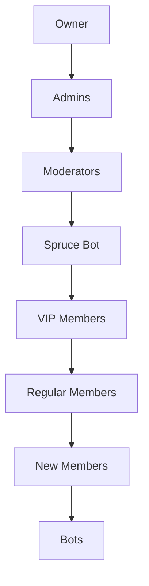

# Role Management Commands

Advanced role assignment and management tools for efficient server administration.

## Quick Reference

| Command | Description | Permission Required |
|---------|-------------|-------------------|
| [`&create_roles <names...>`](#create-roles) | Create multiple roles at once | Manage Roles |
| [`&del_roles <roles...>`](#del-roles) | Delete multiple roles | Manage Roles |
| [`&give_role <role> <members...>`](#give-role) | Give a role to multiple members | Manage Roles |
| [`&remove_role <role> <members...>`](#remove-role) | Remove a role from multiple members | Manage Roles |
| [`&role_all_human <role>`](#role-all-human) | Give a role to all human members | Manage Roles |
| [`&role_all_bot <role>`](#role-all-bot) | Give a role to all bot members | Manage Roles |
| [`&inrole <role>`](#inrole) | List all members with a specific role | Manage Roles |
| [`&port <role1> <role2>`](#port) | Copy all members from role1 to role2 | Manage Roles |

## Overview

Spruce Bot's role management system provides:

- **Bulk Operations** - Manage multiple roles and members efficiently
- **Smart Assignment** - Separate human and bot role management
- **Role Utilities** - Copy, list, and analyze role memberships
- **Safety Features** - Prevents privilege escalation and provides undo options
- **Performance** - Optimized for large servers with rate limiting

!!! tip "Pro Tips"
    - Use bulk operations to save time on large servers
    - Test role commands with small groups first
    - Keep role hierarchy organized for better management
    - Use the undo buttons when available

## Role Creation & Management

### `&create_roles`

Create multiple roles at once with default settings.

<div class="command-syntax">
&create_roles &lt;name1&gt; &lt;name2&gt; &lt;name3&gt; ...
</div>

**Aliases:** `&croles`

**Parameters:**
- `names...` - List of role names to create (space-separated)

**Examples:**
```bash
&create_roles VIP Premium Supporter          # Create 3 roles
&create_roles "Game Master" "Event Host"     # Use quotes for multi-word names
&croles Moderator Admin                      # Using alias
```

**Bot Permissions Required:**
- Manage Roles

**User Permissions Required:**
- Manage Roles

**Features:**
- Creates roles with random colors
- Places new roles below bot's role
- No permissions assigned by default (safe)

??? example "Bulk Role Creation"
    **Creating event roles:**
    ```bash
    &create_roles "Tournament Player" "Tournament Staff" "Tournament Winner"
    ```
    
    **Bot Response:**
    ```
    ✅ Roles Created
    Successfully created 3 roles:
    • Tournament Player
    • Tournament Staff  
    • Tournament Winner
    ```

### `&del_roles`

Delete multiple roles at once.

<div class="command-syntax">
&del_roles &lt;@role1&gt; &lt;@role2&gt; ...
</div>

**Aliases:** `&droles`

**Parameters:**
- `roles...` - List of roles to delete (mention format)

**Examples:**
```bash
&del_roles @OldRole @DeprecatedRole          # Delete specific roles
&droles @"Event Role" @"Temp Role"          # Using alias with quotes
```

**Safety Features:**
- Confirmation required for roles with members
- Cannot delete roles higher than bot's role
- Cannot delete managed roles (from other bots)

!!! warning "Permanent Action"
    Deleted roles cannot be recovered. All members will lose the role permanently.

## Role Assignment

### `&give_role`

Give a role to multiple members at once.

<div class="command-syntax">
&give_role &lt;@role&gt; &lt;@member1&gt; &lt;@member2&gt; ...
</div>

**Aliases:** `&role`

**Parameters:**
- `role` - Role to assign (mention format)
- `members...` - List of members to give the role to

**Examples:**
```bash
&give_role @VIP @alice @bob @charlie         # Give VIP role to 3 members
&role @Moderator @newmod                     # Using alias for single member
```

**Bot Permissions Required:**
- Manage Roles

**User Permissions Required:**
- Manage Roles

**Features:**
- ⏪ **Reverse Role button** - Undo the action
- 🛡️ **Admin protection** - Prevents giving admin roles to multiple users
- 📝 **Works with replies** - Reply to a message to give role to message author

??? example "Mass Role Assignment"
    **Giving event roles:**
    ```bash
    &give_role @EventParticipant @user1 @user2 @user3
    ```
    
    **Bot Response with Undo Button:**
    ```
    ✅ Role Assigned
    Successfully gave @EventParticipant to 3 members
    [🔄 Reverse Role] [❌ Dismiss]
    ```

### `&remove_role`

Remove a role from multiple members.

<div class="command-syntax">
&remove_role &lt;@role&gt; &lt;@member1&gt; &lt;@member2&gt; ...
</div>

**Parameters:**
- `role` - Role to remove (mention format)
- `members...` - List of members to remove the role from

**Examples:**
```bash
&remove_role @TempRole @alice @bob           # Remove role from specific members
&remove_role @Muted @user                    # Remove mute role from user
```

## Bulk Role Operations

### `&role_all_human`

Give a role to all human members in the server.

<div class="command-syntax">
&role_all_human &lt;@role&gt;
</div>

**Parameters:**
- `role` - Role to assign to all human members

**Examples:**
```bash
&role_all_human @Members                     # Give @Members to all humans
&role_all_human @Verified                    # Mass verification role
```

**Safety Features:**
- 🚫 **Admin Protection** - Cannot assign admin roles
- ⏱️ **Rate Limiting** - Automatically handles API limits
- 📊 **Progress Updates** - Shows completion status for large servers

**Use Cases:**
- Server-wide role updates
- New role deployment
- Mass verification after rule changes

### `&role_all_bot`

Give a role to all bot members in the server.

<div class="command-syntax">
&role_all_bot &lt;@role&gt;
</div>

**Parameters:**
- `role` - Role to assign to all bot members

**Examples:**
```bash
&role_all_bot @Bots                          # Give @Bots to all bots
&role_all_bot @Automated                     # Organize bots with role
```

**Features:**
- Only affects Discord bots, not regular users
- Useful for organizing bots in member list
- Helps with permission management

## Role Utilities

### `&inrole`

List all members who have a specific role.

<div class="command-syntax">
&inrole &lt;@role&gt;
</div>

**Parameters:**
- `role` - Role to check membership for

**Examples:**
```bash
&inrole @Moderators                          # List all moderators
&inrole @VIP                                 # Check VIP members
```

**Output Formats:**
- **Small roles** (≤2000 chars) - Embed list with usernames
- **Large roles** (>2000 chars) - Text file attachment

??? example "Role Membership Check"
    **Checking moderator list:**
    ```bash
    &inrole @Moderators
    ```
    
    **Bot Response:**
    ```
    👥 Members with @Moderators (5 members)
    
    • alice#1234
    • bob#5678  
    • charlie#9012
    • diana#3456
    • eve#7890
    ```

### `&port`

Copy all members from one role to another.

<div class="command-syntax">
&port &lt;@source_role&gt; &lt;@destination_role&gt;
</div>

**Parameters:**
- `source_role` - Role to copy members from
- `destination_role` - Role to copy members to

**Examples:**
```bash
&port @TempMembers @Members                  # Move temp members to permanent role
&port @OldModerators @NewModerators          # Transfer staff to new role
```

**Use Cases:**
- Server restructuring
- Role migrations  
- Backup role assignments
- Transferring permissions

**Features:**
- Non-destructive (original role memberships remain)
- Rate-limited for large role transfers
- Progress updates for transparency

## Advanced Operations

### `&remove_members`

Remove a role from ALL its members.

<div class="command-syntax">
&remove_members &lt;@role&gt; [reason]
</div>

**Parameters:**
- `role` - Role to remove from all members
- `reason` (optional) - Reason for mass removal

**Examples:**
```bash
&remove_members @EventParticipant "Event ended"
&remove_members @TempRole                    # Remove without reason
```

**User Permissions Required:**
- Administrator

!!! warning "Mass Action"
    This affects ALL members with the role. Use with extreme caution!

**Confirmation Required:**
- Interactive confirmation dialog
- Shows affected member count
- Cannot be undone

### Role Display Management

#### `&hide_roles`

Hide all roles from the member list display.

<div class="command-syntax">
&hide_roles
</div>

**No parameters required**

**Effect:**
- Makes all roles non-hoisted (not displayed separately in member list)
- Useful for cleaning up member list organization
- Does not affect role permissions

#### `&unhide_roles`

Show specific roles in the member list.

<div class="command-syntax">
&unhide_roles &lt;@role1&gt; &lt;@role2&gt; ...
</div>

**Aliases:** `&hoist`

**Parameters:**
- `roles...` - Roles to make visible in member list

**Examples:**
```bash
&unhide_roles @Moderator @Admin @VIP         # Show important roles
&hoist @Staff @Helper                        # Using alias
```

## Performance & Safety

### Rate Limiting

All bulk operations include built-in rate limiting:

- **Small batches** (≤10 members) - Immediate processing
- **Medium batches** (11-50 members) - 1-second delays
- **Large batches** (51+ members) - 2-second delays with progress updates

### Safety Features

=== "Privilege Protection"
    - Cannot assign roles higher than bot's role
    - Prevents admin role assignment to multiple users
    - Checks role hierarchy before operations

=== "Confirmation Dialogs"
    - Destructive actions require confirmation
    - Shows affected member/role counts
    - Provides cancel options

=== "Undo Functionality"
    - Reverse buttons for role assignments
    - 10-minute timeout for undo actions
    - Clear action descriptions

## Troubleshooting

### Common Issues

=== "Role Hierarchy Errors"
    **Error:** "Role is higher than mine"
    
    **Solution:** Move bot's role above target roles in Server Settings → Roles

=== "Missing Permissions"
    **Error:** "I don't have permission to manage this role"
    
    **Solutions:**
    - Grant bot "Manage Roles" permission
    - Check if role is managed by another bot
    - Verify role isn't @everyone

=== "Large Server Performance"
    **Issue:** Commands timing out on large servers
    
    **Solutions:**
    - Use smaller batches
    - Wait between operations
    - Monitor for rate limits

### Best Practices

#### Role Organization



#### Workflow Recommendations

1. **Plan role structure** before implementation
2. **Test with small groups** before mass operations
3. **Use descriptive role names** for clarity
4. **Document role purposes** for staff
5. **Regular role audits** to remove unused roles

## Integration with Other Features

Role management works seamlessly with:

- **[AutoRole System](autorole.md)** - Automatic assignment for new members
- **[Moderation Commands](moderation.md)** - Channel permissions based on roles  
- **[Tournament System](tournaments.md)** - Role-based tournament access
- **[Utility Commands](utility.md)** - Role information display

## Support

Need help with role management?

- 📚 **[Common Issues](../troubleshooting/common-issues.md)** - Solutions to frequent problems
- 💬 **[Support Server](https://discord.gg/vMnhpAyFZm)** - Get help from our community
- 📧 **Email**: support@nexinlabs.com

---

**Next:** Learn about [Utility Commands →](utility.md)
