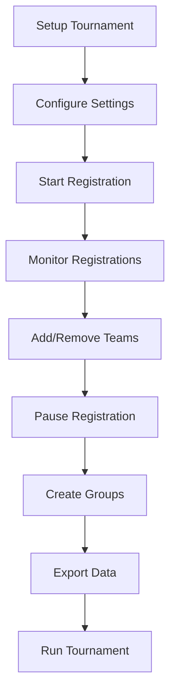
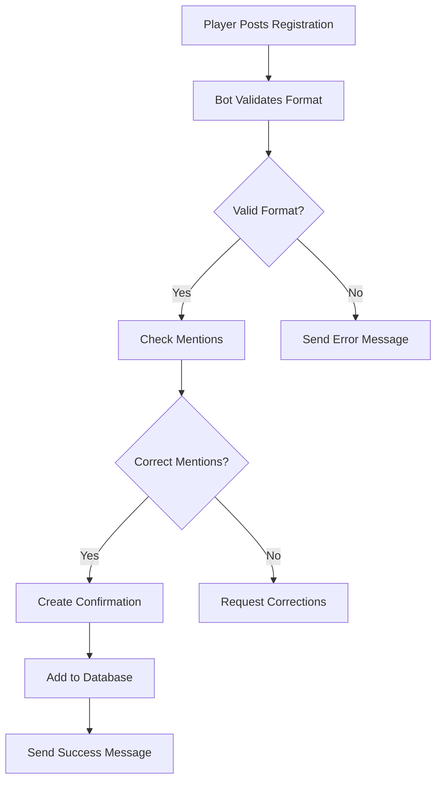

# Tournament Commands

Complete esports tournament management system for Discord servers.

## Quick Reference

| Command | Description | Permission Required |
|---------|-------------|-------------------|
| [`/tourney setup`](#tourney-setup) | Create a new tournament | Manage Channels or @tourney-mod |
| [`/tourney start`](#tourney-start) | Start tournament registration | @tourney-mod |
| [`/tourney pause`](#tourney-pause) | Pause tournament registration | @tourney-mod |
| [`/tourney info`](#tourney-info) | View tournament information | None |
| [`/tourney list`](#tourney-list) | List all active tournaments | @tourney-mod |
| [`/tourney add team`](#tourney-add-team) | Manually add a team | @tourney-mod |
| [`/tourney remove team`](#tourney-remove-team) | Remove a team | @tourney-mod |
| [`/tourney auto_group`](#tourney-auto-group) | Create tournament groups | @tourney-mod |

## Overview

Spruce Bot's tournament system provides:

- **Complete Tournament Setup** - Automated channel and role creation
- **Registration Management** - Player registration with validation
- **Team Organization** - Automatic grouping and bracket creation
- **Slot Management** - Manual team addition/removal
- **Advanced Features** - ID verification, fake tag detection
- **Export Options** - CSV data export for external tools

!!! tip "Tournament Workflow"
    1. **Setup** tournament with `/tourney setup`
    2. **Configure** settings as needed
    3. **Start** registration with `/tourney start`
    4. **Monitor** registrations and manage teams
    5. **Create groups** with `/tourney auto_group`
    6. **Export** data for brackets/streaming

## Tournament Setup

### `/tourney setup`

Create a complete tournament infrastructure with channels, roles, and configuration.

<div class="command-syntax">
/tourney setup slots:&lt;total&gt; mentions:&lt;count&gt; slot_per_group:&lt;size&gt; tournament_name:&lt;name&gt;
</div>

**Parameters:**
- `slots` - Total number of teams (2-500)
- `mentions` - Players to mention per team (0-11)
- `slot_per_group` - Teams per group (2-25)
- `tournament_name` - Tournament name (max 30 chars)

**Examples:**
```bash
/tourney setup slots:144 mentions:4 slot_per_group:12 tournament_name:"Weekly Cup"
/tourney setup slots:64 mentions:5 slot_per_group:8 tournament_name:"Championship"
```

**Bot Permissions Required:**
- Manage Channels
- Manage Roles
- Send Messages

**User Permissions Required:**
- Manage Channels (or @tourney-mod role)

**What Gets Created:**

=== "Channels"
    - 📋 **Info** - Tournament information
    - 📢 **Updates** - Announcements and updates  
    - 📝 **How-to-register** - Registration form template
    - ✅ **Register-here** - Team registration submissions
    - 👥 **Confirmed-teams** - Confirmed team listings
    - 🏆 **Groups** - Tournament group assignments
    - ❓ **Queries** - Questions and support

=== "Roles & Permissions"
    - 🎯 **Confirm Role** - For confirmed participants
    - 🔒 **Locked Permissions** - Prevents @everyone from posting
    - 🤖 **Bot Permissions** - Full access for management
    - 👑 **Organizer Access** - Full permissions for tournament creator

??? example "Tournament Setup Process"
    **Creating a 144-slot tournament:**
    ```bash
    /tourney setup slots:144 mentions:4 slot_per_group:12 tournament_name:"BGMI Weekly"
    ```
    
    **Bot creates:**
    ```
    📁 BGMI Weekly Category
    ├── 📋 bgmi-info
    ├── 📢 bgmi-updates  
    ├── 📝 bgmi-how-to-register
    ├── ✅ bgmi-register-here
    ├── 👥 bgmi-confirmed-teams
    ├── 🏆 bgmi-groups
    └── ❓ bgmi-queries
    
    🎭 @bgmi-confirm role created
    ```

**Server Requirements:**
- Less than 50 categories
- Less than 490 total channels
- Available role slots
- Sufficient permissions

**Limitations:**
- Maximum 5 tournaments per server
- Channel and category limits apply
- Rate limiting for large operations

## Registration Management

### `/tourney start`

Open tournament registration for teams.

<div class="command-syntax">
/tourney start channel:&lt;registration_channel&gt;
</div>

**Parameters:**
- `channel` - The registration channel from tournament setup

**Examples:**
```bash
/tourney start channel:#bgmi-register-here
```

**Effects:**
- ✅ Opens registration channel for @everyone
- 📢 Sends registration open announcement
- 🔄 Updates tournament status to active
- 📝 Enables team registration processing

### `/tourney pause`

Temporarily pause tournament registration.

<div class="command-syntax">
/tourney pause channel:&lt;registration_channel&gt;
</div>

**Parameters:**
- `channel` - The registration channel to pause

**Examples:**
```bash
/tourney pause channel:#bgmi-register-here
```

**Effects:**
- ⏸️ Locks registration channel
- 📢 Sends pause announcement
- 🔄 Updates tournament status to inactive
- 📝 Prevents new team registrations

### `/tourney info`

Display comprehensive tournament information.

<div class="command-syntax">
/tourney info channel:&lt;registration_channel&gt;
</div>

**Parameters:**
- `channel` - Registration channel to get info for

**Information Displayed:**

=== "Basic Details"
    - Tournament name and status
    - Total slots and filled slots
    - Mentions per team
    - Slots per group

=== "Channels"
    - Registration channel
    - Confirmed teams channel
    - Groups channel
    - Other tournament channels

=== "Statistics"
    - Registered teams count
    - Remaining slots
    - Registration rate
    - Last activity

## Team Management

### `/tourney add team`

Manually add a team to the tournament.

<div class="command-syntax">
/tourney add team channel:&lt;reg_channel&gt; captain:&lt;member&gt; team_name:&lt;name&gt;
</div>

**Parameters:**
- `channel` - Registration channel
- `captain` - Team captain (Discord member)
- `team_name` - Name of the team

**Examples:**
```bash
/tourney add team channel:#register captain:@alice team_name:"Team Alpha"
/tourney add team channel:#register captain:@bob team_name:"Pro Squad"
```

**User Permissions Required:**
- @tourney-mod role

**Process:**
1. Validates team name and captain
2. Checks available slots
3. Creates confirmation message
4. Adds team to tournament database
5. Notifies in appropriate channels

**Validation Checks:**
- Team name uniqueness
- Captain not already registered
- Available tournament slots
- Active tournament status

### `/tourney remove team`

Remove a team from the tournament.

<div class="command-syntax">
/tourney remove team channel:&lt;reg_channel&gt; captain:&lt;member&gt; [reason]
</div>

**Parameters:**
- `channel` - Registration channel
- `captain` - Team captain to remove
- `reason` (optional) - Reason for removal

**Examples:**
```bash
/tourney remove team channel:#register captain:@alice reason:"Rule violation"
/tourney remove team channel:#register captain:@bob
```

**Effects:**
- Removes team from tournament
- Deletes confirmation message
- Frees up tournament slot
- Logs removal with reason
- Notifies affected players

## Tournament Organization

### `/tourney auto_group`

Automatically create tournament groups and assign teams.

<div class="command-syntax">
/tourney auto_group channel:&lt;registration_channel&gt;
</div>

**Parameters:**
- `channel` - Registration channel of tournament

**Examples:**
```bash
/tourney auto_group channel:#bgmi-register-here
```

**Requirements:**
- Registration must be closed/paused
- Sufficient registered teams
- Clean confirmed teams channel
- Proper group configuration

**Process:**

=== "Group Creation"
    1. **Calculates groups** based on registered teams and slots per group
    2. **Creates group channels** (Group-1, Group-2, etc.)
    3. **Assigns teams** randomly to groups
    4. **Sets permissions** for group-specific access

=== "Team Assignment"
    1. **Random distribution** for fairness
    2. **Equal group sizes** (as much as possible)
    3. **Role assignments** for group members
    4. **Channel permissions** per group

??? example "Auto Grouping Process"
    **144 teams, 12 per group:**
    ```
    📊 Auto Grouping Results:
    
    🏆 12 Groups Created:
    ├── Group-1 (12 teams) - #group-1-channel
    ├── Group-2 (12 teams) - #group-2-channel
    ├── ... (continuing pattern)
    └── Group-12 (12 teams) - #group-12-channel
    
    👥 Teams assigned roles:
    • @group-1-members
    • @group-2-members
    • ... (etc.)
    ```

**Features:**
- 🎲 **Random Assignment** - Fair team distribution
- 📊 **Equal Groups** - Balanced group sizes
- 🔒 **Group Permissions** - Private group channels
- 📱 **Mobile Friendly** - Optimized group displays

## Advanced Features

### Tournament Configuration

#### `/tourney set total_slots`

Update the total number of available slots.

<div class="command-syntax">
/tourney set total_slots channel:&lt;reg_channel&gt; slots:&lt;number&gt;
</div>

#### `/tourney set mentions`

Change how many players each team must mention.

<div class="command-syntax">
/tourney set mentions channel:&lt;reg_channel&gt; mentions:&lt;count&gt;
</div>

#### `/tourney set slots_per_group`

Modify the number of teams per group.

<div class="command-syntax">
/tourney set slots_per_group channel:&lt;reg_channel&gt; slots_per_group:&lt;size&gt;
</div>

### Special Features

#### `/tourney faketag`

Toggle fake tag detection for team names.

<div class="command-syntax">
/tourney faketag channel:&lt;registration_channel&gt;
</div>

**Purpose:**
- Prevents teams from using fake/non-existent clan tags
- Validates team names against known patterns
- Reduces registration fraud

#### `/tourney girls_lobby`

Create separate voice channels for female participants.

<div class="command-syntax">
/tourney girls_lobby vc_amount:&lt;number&gt;
</div>

**Parameters:**
- `vc_amount` - Number of voice channels to create

**Features:**
- Creates dedicated voice channels
- Special permissions for verified female participants
- Organized tournament structure

### Data Management

#### `/tourney export`

Export tournament data as CSV file.

<div class="command-syntax">
/tourney export channel:&lt;registration_channel&gt;
</div>

**Exported Data:**
- Team names and captains
- Player lists with IDs
- Registration timestamps
- Group assignments (if created)
- Contact information

**Use Cases:**
- External bracket creation
- Streaming overlays
- Prize distribution
- Statistical analysis

#### `/tourney list`

Show all active tournaments in the server.

<div class="command-syntax">
/tourney list
</div>

**Display Format:**
- Tournament names and status
- Registration counts
- Quick action buttons
- Channel links

## Tournament Workflow

### Typical Tournament Process



### Registration Process



## Troubleshooting

### Common Issues

=== "Setup Failures"
    **Problem:** Tournament setup command fails
    
    **Solutions:**
    - Check server has enough channel slots (under 490 total)
    - Verify bot has Manage Channels permission
    - Ensure server has less than 50 categories
    - Check if you have required permissions

=== "Registration Problems"
    **Problem:** Teams can't register or format issues
    
    **Solutions:**
    - Verify registration is open (`/tourney info`)
    - Check registration format in how-to-register channel
    - Ensure players are mentioning correct number of teammates
    - Verify fake tag detection settings

=== "Auto Group Issues"
    **Problem:** Auto grouping fails or creates wrong groups
    
    **Solutions:**
    - Ensure registration is paused/closed
    - Clear confirmed teams channel of extra messages
    - Check if enough teams are registered
    - Verify slots per group setting is correct

### Error Messages

| Error | Meaning | Solution |
|-------|---------|----------|
| "Too many categories" | Server has 50+ categories | Delete unused categories |
| "Too many channels" | Server approaching 500 channel limit | Clean up old channels |
| "No active tournament" | Tournament not found for channel | Check correct registration channel |
| "Registration closed" | Tournament registration paused | Use `/tourney start` to resume |
| "Insufficient slots" | Tournament full | Increase total slots or remove teams |

## Best Practices

### Tournament Organization

=== "Planning Phase"
    - **Calculate slots** based on expected participation
    - **Set appropriate mentions** (usually 4-5 for team games)
    - **Plan group sizes** for bracket format
    - **Prepare rules** and guidelines

=== "Management Phase"
    - **Monitor registrations** regularly
    - **Respond to queries** quickly in queries channel
    - **Validate team formats** manually if needed
    - **Keep backups** of participant data

=== "Execution Phase"
    - **Create groups** when registration complete
    - **Export data** for external tools
    - **Coordinate** with streaming/casting teams
    - **Manage** bracket progression

### Performance Tips

- **Limit concurrent tournaments** to 2-3 per server
- **Use batch operations** for large tournaments
- **Monitor rate limits** during peak registration
- **Plan channel structure** before setup

## Integration Features

### Role-Based Access

Tournament system integrates with server roles:

- **@tourney-mod** - Tournament management permissions
- **Tournament-specific roles** - Created per tournament
- **Group roles** - Assigned during auto grouping

### Logging Integration

All tournament actions are logged:

- Setup and configuration changes
- Team registrations and removals
- Status changes (start/pause)
- Group creation events

## Support

Need help with tournaments?

- 📚 **[Tournament Setup Guide](../guides/tournament-setup.md)** - Step-by-step setup
- 🛠️ **[Troubleshooting](../troubleshooting/)** - Common issues and solutions
- 💬 **[Support Server](https://discord.gg/vMnhpAyFZm)** - Get help from our community
- 📧 **Email**: support@nexinlabs.com

---

**Next:** Learn about [Scrim Commands →](scrims.md)
